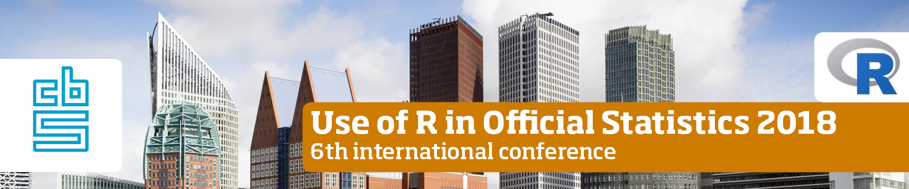

```{r setup, include=FALSE}
knitr::opts_chunk$set(echo = FALSE)
```

# Statistics Austria

## Introducing R

### At first
- Started very "unofficial"
- Self installed R versions floating around in the office
- No support

### First improvments
- Standardized R installation
- Specific units allowed to use R
- First R server


## Support and policy

### Support
- Official support infrastructure (Jira) and responsible unit (Methods)
- RStudio on server (and desktop)
- Presentation of R projects (twice a year)

### Policy
- R is a strategic software and allowed to be used throughout the production chain


## Infrastructure

- R Desktop is deprecated (to be switched off at the end of 2018?!)
- R Studio Server Pro on a Linux (Ubuntu) server with 16 cores and 128 GB memory
- about 100 users on the R server
- $\pm$ 40 weekly active users

## Training
-	**Introductory course**: RStudio, Import-Export, important functions and writing own functions.
- **Data manipulation**: Some R base data manipulation stuff and dplyr
-	**Data manipulation with data.table**
-	**Graphics**: base graphics + ggplot2
-	**R for Developers**: package development, debugging, profiling, RCPP, SVN and GIT
-	**R for survey data**: Handling “our” survey data with the R package survey
- **(Transitioning from desktop to server R)**

## Development
 - Several CRAN packages (VIM, sdcMicro, sdcTable, x12, ...)
 - Internal R packages for projects or tasks, e.g.:
    - sampSTAT for sampling from the frame for households and persons
    - mountSTAT fr handling the Windows file shares under Windows
 

# Statistics Netherlands

## Introducing R


### Typical hurdles (2010):

- How to install FOSS? 
- OMG everybody can write CODE now!

### Approach

- Project with dedicated project leader
- Standardized 3 installation types geared to different user types.
- Set up code/documentation standards

### Currently

- $\pm$ 200 users ($\pm 100$ active)
- One single central installation
- Refer to tidy code/documentation standard

## Support and policy

### Local user group _kennR!_

- Beginner's course & advanced workshops
- User meetings & support
- Functional management

### FOSS Contribution Policy (in short)

- When relevant to statistics Netherlands, with positive business case.

## Packages and literature contributed

\begin{center}
\begin{tabular}{p{0.45\textwidth}p{0.45\textwidth}}
\includegraphics[width=0.45\textwidth]{fig/wordcloud.pdf}&
\includegraphics[width=0.40\textwidth]{fig/SDCR.jpg}
\end{tabular}
\end{center}

## Current infrastructure

- R + RStudio on central folder
    - R-engine usable by non-programmers who just run a script
    - Selection of R packages pre-installed
    - Full CRAN repo available internally (there's no direct internet access from most VM's)
- RDS server (8core, 64G VM's) for heavier work
- Working on connection to Spark server (Sparklyr)
- Working on RStudio/Shiny server


# General remarks

## Lessons learned
- Central installation or server solution preferable
- Training courses are necessary
- Support is needed when the number of users grow
- Community is important
- Internal CRAN mirror for IT security
- There is a lot of free support from the world-wide community

### See also

Kowarik and Van der Loo (2018). Romanian Statistical Review 1/2018 pp. 15-29


## Collaboration opportunities

- Packages can be easily shared
- Interface is unified by R, including interface with C/C++, Python,$\ldots$
- Bottom-up approach much more efficient than defining everything beforehand
- Interesting packages can be found at
    - Official Statistics Task View (CRAN)
    - [www.awesomeofficialstatistics.org](http://www.awesomeofficialstatistics.org)


## Inivitation




**Statistics Netherlands, Den Haag**

- 12-14 September: uRos2018 conference
- 10-11 September: unconfUROS hackathon event

### More information:

`www.uRos2018.org | @uRos2018 | uRos2018@cbs.nl`

## temp

 - **[The use of R in official statistics](https://www.aanmelder.nl/uros2018)**
 - **[unconfUROS](https://github.com/uRos2018/unconfUROS)**
 
 - [eRum 2018](http://2018.erum.io/)
 

